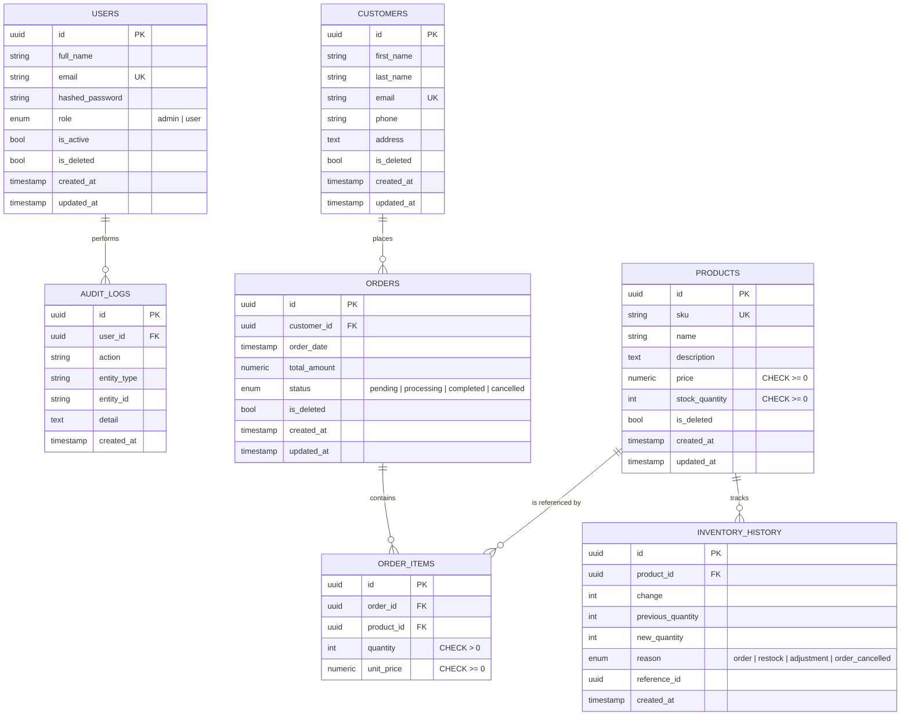

# Database Design

UUID primary keys are used across all tables. Timestamps are timezone-aware.
Products, customers, orders and users support **soft delete** via `is_deleted` /
`deleted_at`.

## ER Diagram

## Relationships

- One **Customer** → many **Orders**
- One **Order** → many **Order Items**
- One **Product** → many **Order Items**
- One **Product** → many **Inventory History** entries
- One **User** → many **Audit Logs**

## Constraints

| Table        | Constraint                                  |
| ------------ | ------------------------------------------- |
| products     | `sku` unique; `price >= 0`; `stock >= 0`    |
| customers    | `email` unique                              |
| users        | `email` unique                              |
| order_items  | `quantity > 0`; `unit_price >= 0`           |

Migrations are managed by Alembic (`backend/alembic/versions/0001_initial_schema.py`).
